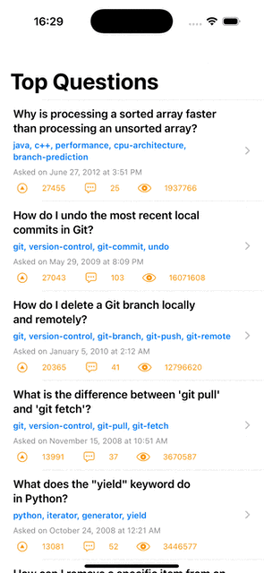

# QuickProto

### License

QuickProto is based on [DynamicJSON](https://github.com/saoudrizwan/DynamicJSON) by Saoud Rizwan, originally released under the MIT License.

Modifications and additions by Cristian Felipe Patiño Rojas (2025) include:
- A SwiftUI `AsyncView` component for working with remote JSON
- Minor modifications to Saoud's `DynamicJSON` core

QuickProto is released under the MIT License. See the [LICENSE](./LICENSE) file for details.
