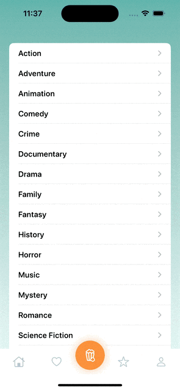

# AsyncView

- Minimal SwiftUI component for rendering remote JSON.
- Fetches and renders remote data using only a URL and a SwiftUI closure.
- Supports nested paths via keyPath (e.g. "items", "results").
- Works with any JSON API, no Codable required.
- Minimal boilerplate. Drop in and use.


## Similar concepts

- [MarkoJS Await](https://markojs.com/docs/core-tags/#await)
- SwiftUI's native `AsyncImage`

## Usage

Prototype:

```swift
AsyncView("https://api.example.com/recipes", keyPath: "items") { json in
    ForEach(json.array, id: \.id.string) { recipe in
        Text(recipe.title.string)
        AsyncImage(recipe.image_url.url)
    }
}
```

Then extract components as needed:

```swift
AsyncView("https://api.example.com/recipes", keyPath: "items") { json in
    ForEach(json.array, id: \.id.string) { recipe in
        Cell(
            id: recipe.id.uuid, 
            title: recipe.title, 
            picURL: recipe.image_url
        )
    }
}
```

## Limitations

- Designed for prototyping, not production.
- Basic error handling for now — extendable if needed.
- JSON parsing is dynamic and loose — there’s no type safety (as in Javascript, but that's the goal).

## When it makes sense

AsyncView was built for prototyping, but production usage is possible when:

- The API is stable and fully owned.
- Rendered content is ephemeral and non-critical.
- Ideal for internal tools, MVPs, demos, or disposable experiments focused on logic, UX, or rapid iteration — not architecture.

### Examples

#### Stackoverflow client


Original UI took from M.Manferdini: https://matteomanferdini.com/swift-rest-api

#### Movies



[See source code](https://github.com/crisfeim/app-movies)

### License

AsyncView relies on a `JSON` representation based on [DynamicJSON](https://github.com/saoudrizwan/DynamicJSON) by Saoud Rizwan, originally released under the MIT License.

Modifications include:
- A SwiftUI `AsyncView` component for working with remote JSON
- Minor modifications to Saoud's `DynamicJSON` core (mostly, a matter of preference)

AsyncView is released under the MIT License. See the [LICENSE](./LICENSE) file for details.
